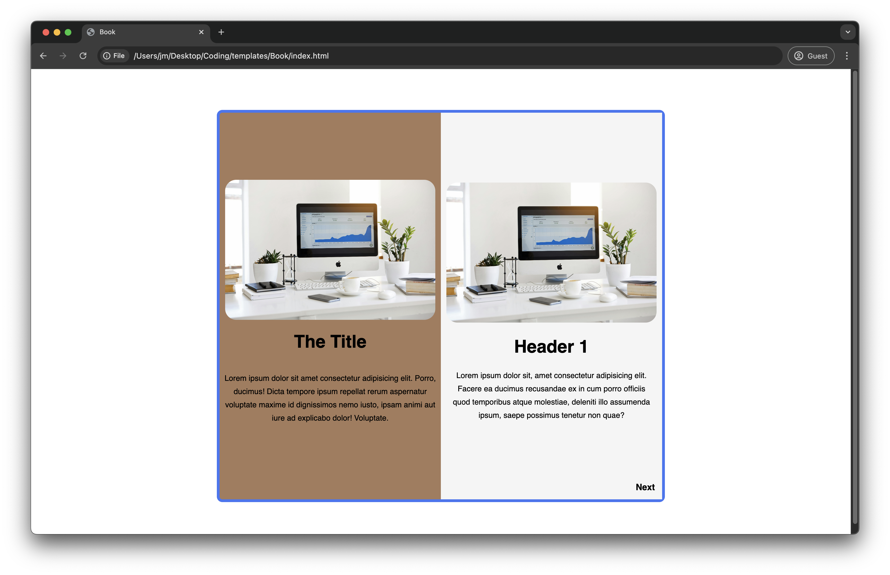

# Templates
[Click here to see Deployed Site which contains links to templates](https://uwttn.github.io/templates/)

# Project Templates Repository

This repository contains a collection of project templates that can be used as starting points for various types of projects. These templates are intended for personal or shared use.

## Folder Structure

`web-template/` : A basic template for web development projects with HTML, CSS, and JS setup.

## How to Use

1. Clone the repository:
   ```
   git clone https://github.com/Uwttn/templates.git 
   ```
2. Modify the template as per your project needs.

## Customization

After copying a template, be sure to:

- Update `README.md` with details about your new project.

## Contributing

Contributions are welcome! Feel free to open a pull request with any new templates or improvements.

<div align="center">

## Preview of Notebook - Created on 2024.10.04



</div>

Below are badges used on my READMEs

<div align="center">

[](https://www.w3schools.com/html/)
[](https://www.w3schools.com/css/)
[](https://www.w3schools.com/js/default.asp)
[](https://www.w3schools.com/postgresql/index.php)
[](https://www.w3schools.com/mongodb/index.php)
[](https://www.w3schools.com/mysql/default.asp)
[](https://nodejs.org/en/)
[](https://expressjs.com/)
[](https://expressjs.com/)
[](https://webpack.js.org/)
[](https://babeljs.io/)
[](https://codemirror.net/)
[](https://www.npmjs.com/)
[](https://render.com)
[](https://code.visualstudio.com/docs)
</div>

<div align="center">